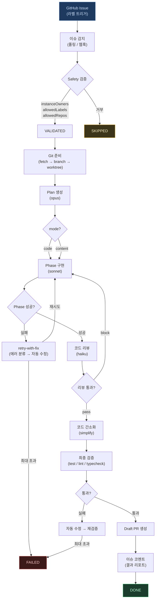

# AI Quartermaster (AQM)

GitHub Issue에 라벨을 붙이면 Claude가 자동으로 구현하고 Draft PR을 만들어줍니다.

## 설치

```bash
curl -fsSL https://raw.githubusercontent.com/happytalkrz/AI-Quartermaster/main/install.sh | bash
```

**필수 요구사항:**
- macOS / Linux / WSL (Windows 네이티브 미지원)
- Node.js 20+
- Git
- [GitHub CLI](https://cli.github.com) (`gh auth login` 완료)
- [Claude CLI](https://docs.anthropic.com/en/docs/claude-code) (Claude Max 요금제 권장)

**Public / Private 레포 모두 지원** — `gh auth login` 인증 토큰에 repo 접근 권한이 있으면 Private 레포에서도 동작합니다.

## 빠른 시작

```bash
# 1. 초기 설정 (config, .env, credential 자동 구성)
aqm setup

# 2. config.yml 수정 — projects 섹션에 대상 프로젝트 추가
#    (아래 '설정' 섹션 참고)

# 3. 서버 시작
aqm start --daemon --mode polling          # 폴링 모드 (추천, webhook 설정 불필요)
aqm start --daemon                         # 웹훅 모드 (smee.io 자동 연결)

# 4. GitHub 이슈에 'aqm' 라벨 붙이기 → 자동 실행!
```

## 작동 방식



### 상태 머신

```
RECEIVED → VALIDATED → BASE_SYNCED → BRANCH_CREATED → WORKTREE_CREATED
→ PLAN_GENERATED → PHASE_IN_PROGRESS ⇄ PHASE_FAILED
→ REVIEWING → SIMPLIFYING → FINAL_VALIDATING → DRAFT_PR_CREATED → DONE
                                                                 ↘ FAILED
```

## 명령어

### 서버

```bash
aqm start                                       # 웹훅 서버 (포그라운드)
aqm start --daemon                              # 백그라운드 실행
aqm start --mode polling                        # 폴링 모드 (60초 간격)
aqm start --mode polling --interval 30          # 30초 간격 폴링
aqm start --daemon --mode polling --port 8080   # 모든 옵션 조합 가능
aqm start --host 0.0.0.0                        # 모든 인터페이스 바인드 (DASHBOARD_API_KEY 필수)
aqm stop                                        # 서버 중지
aqm restart                                     # 서버 재시작
aqm logs                                        # 서버 로그 실시간 확인
```

### 파이프라인

```bash
aqm run --issue 42 --repo owner/repo            # 특정 이슈 수동 실행
aqm resume --job <id>                           # 실패한 파이프라인을 마지막 체크포인트에서 재개
aqm resume --issue 42 --repo owner/repo         # 이슈 번호로 재개
aqm plan --repo owner/repo                      # 열린 이슈 분석 → 실행 계획 출력
aqm plan --repo owner/repo --execute            # 분석 후 자동 실행
```

### 모니터링

```bash
aqm status                                      # 큐 상태 (대기/실행 중/완료)
aqm stats                                       # 성공률, 실패 패턴, 평균 시간
aqm stats --repo owner/repo                     # 프로젝트별 통계
aqm doctor                                      # 환경 점검 (git, gh, claude, 포트 등)
```

### 관리

```bash
aqm setup                                       # 초기 설정
aqm setup-webhook --repo owner/repo             # GitHub webhook 수동 등록
aqm cleanup                                     # 오래된 worktree 정리
aqm update                                      # 최신 버전 업데이트
aqm version                                     # 버전 확인
aqm uninstall                                   # 완전 삭제
aqm help                                        # 전체 명령어 도움말
```

## 실행 모드

`--mode` CLI 옵션 또는 config의 `general.serverMode` 필드로 지정합니다.

| 모드 | 명령 | 특징 |
|------|------|------|
| `webhook` | `aqm start` | 실시간, GITHUB_WEBHOOK_SECRET 필수 |
| `polling` | `aqm start --mode polling` | 간편, webhook 설정 불필요 |
| `hybrid` | `aqm start --mode hybrid` | webhook + 폴링 병행, 이벤트 유실 방지 |

### 폴링 모드 (추천)
주기적으로 GitHub API를 호출해서 트리거 라벨이 붙은 이슈를 감지합니다.
webhook이나 smee.io 설정이 필요 없어서 간편합니다.

```bash
aqm start --mode polling                        # 기본 60초 간격
aqm start --mode polling --interval 30          # 30초 간격
```

### 웹훅 모드
GitHub webhook → smee.io 프록시 → AQM 서버. 실시간 반응이 필요할 때.
`aqm setup`에서 smee 채널이 자동 생성됩니다.

```bash
aqm start                                       # hybrid 모드 (기본)
```

### 하이브리드 모드
webhook과 폴링을 동시에 운영합니다. webhook으로 실시간 이벤트를 받으면서,
폴링으로 missed events(네트워크 오류, 재시작 등)를 보완합니다.

- **중복 처리 방지**: 동일 이슈가 webhook과 poller 양쪽에서 감지돼도 `IssuePoller`의 기존 중복 체크(`store.findAnyByIssue`)로 한 번만 실행됩니다.
- **Rate limit**: 폴링 간격을 길게 설정(`--interval 120` 이상)해 GitHub API 사용량을 절감하세요.
- **GITHUB_WEBHOOK_SECRET** 필수 (webhook 경로 활성화).

```bash
aqm start --mode hybrid                         # hybrid 모드 (60초 폴링 기본)
aqm start --mode hybrid --interval 120          # 2분 간격 폴링
```

## 설정 (config.yml)

`aqm setup` 실행 시 `~/.ai-quartermaster/config.yml`이 자동 생성됩니다.

### 프로젝트 등록 (필수)

```yaml
projects:
  - repo: "myorg/my-repo"              # GitHub 저장소 (owner/repo 형식)
    path: "/home/user/my-repo"         # 로컬 클론 절대 경로
    baseBranch: "main"                 # 기본 브랜치
```

여러 프로젝트 등록 가능:

```yaml
projects:
  - repo: "myorg/frontend"
    path: "/home/user/frontend"
    baseBranch: "main"
    commands:
      test: "yarn test"
      lint: "yarn lint"
  - repo: "myorg/backend"
    path: "/home/user/backend"
    baseBranch: "develop"
    commands:
      test: "go test ./..."
      lint: "golangci-lint run"
```

### 동시 실행

```yaml
general:
  concurrency: 1                       # 동시 파이프라인 수 (기본: 1)
  # concurrency: 3                     # 3개 병렬 실행
```

### 모델 라우팅

태스크별로 다른 Claude 모델을 사용합니다:

```yaml
commands:
  claudeCli:
    model: "claude-sonnet-4-20250514"           # 글로벌 기본
    models:
      plan: "claude-opus-4-5"                   # Plan 생성 (복잡한 분석)
      phase: "claude-sonnet-4-20250514"         # Phase 구현 (코딩)
      review: "claude-haiku-4-5-20251001"       # 리뷰/검증 (빠른 확인)
      fallback: "claude-sonnet-4-20250514"      # 실패 시 재시도
```

### 안전장치

```yaml
safety:
  maxPhases: 10                        # 최대 Phase 수
  maxRetries: 3                        # Phase 실패 시 재시도 횟수
  maxFileChanges: 50                   # 최대 변경 파일 수
  maxInsertions: 2000                  # 최대 추가 라인
  maxDeletions: 1000                   # 최대 삭제 라인
  rollbackStrategy: "failed-only"     # 실패 시 롤백: none / all / failed-only
  sensitivePaths:                      # 수정 금지 경로
    - ".env"
    - "*.pem"
    - "secrets/**"
  allowedLabels:                       # 트리거 라벨 (이슈에 이 라벨이 있어야 실행)
    - "aqm"
```

### 리뷰 설정

```yaml
review:
  enabled: true
  rounds:                              # 리뷰 라운드 (순차 실행)
    - name: "code-review"
      promptTemplate: "review-round1.md"
      failAction: "warn"               # block: 중단 / warn: 경고 후 계속 / retry: 재시도
      maxRetries: 2
  simplify:
    enabled: true                      # 코드 간소화 단계 활성화
```

### PR 설정

```yaml
pr:
  draft: true                          # Draft PR로 생성 (기본)
  autoMerge: false                     # CI 통과 시 자동 머지
  mergeMethod: "squash"                # merge / squash / rebase
  labels: ["ai-generated"]
  linkIssue: true                      # PR에 이슈 링크 자동 추가
```

### 기타 설정

```yaml
general:
  logLevel: "info"                     # debug / info / warn / error
  dryRun: false                        # true: push/PR 생성 스킵
  pollingIntervalMs: 60000             # 폴링 간격 (ms)
  stuckTimeoutMs: 600000               # stuck job 감지 타임아웃 (ms)
  maxJobs: 500                         # 최대 job 보관 수

commands:
  claudeMdPath: "CLAUDE.md"           # 프로젝트 컨벤션 파일 (자동 주입)
  test: "npm test"
  lint: "npm run lint"
  build: "npm run build"
  typecheck: "npm run typecheck"
  preInstall: ""                       # worktree 생성 후 의존성 설치 (기본값: 없음)
```

## 대시보드

`http://localhost:3000` — 실시간 작업 상태, Phase 진행률, 로그 스트리밍.

- 다크/라이트 테마 전환
- 한국어/영어 전환
- 작업 필터링 (실행 중/성공/실패/대기)
- 실패 작업 재시도 버튼

### 대시보드 접근 주소

기본적으로 AQM은 `127.0.0.1`(localhost)에만 바인딩됩니다. 외부 접근이 필요한 경우 `--host` 옵션으로 바인드 주소를 변경할 수 있습니다:

```bash
aqm start                          # 기본: 127.0.0.1:3000 (localhost만 접근 가능)
aqm start --host 0.0.0.0           # 모든 인터페이스 (외부 접근 허용, API 키 필수)
aqm start --host 192.168.1.100     # 특정 네트워크 인터페이스
```

### 대시보드 인증

`.env`에 `DASHBOARD_API_KEY`를 설정하면 모든 API 엔드포인트에 인증이 적용됩니다:

```env
DASHBOARD_API_KEY=your-secret-key-here
```

인증이 활성화되면 브라우저 로그인 화면이 표시되고, API 호출 시 `Authorization: Bearer <key>` 헤더가 필요합니다.

### Non-local bind 보안 정책

`--host`를 `127.0.0.1` / `localhost` 이외의 주소로 설정하면 **`DASHBOARD_API_KEY` 설정이 강제**됩니다. API 키 없이 서버를 시작하면 아래 오류와 함께 즉시 종료됩니다:

```
✗ 보안 오류: non-local bind(0.0.0.0)에서 DASHBOARD_API_KEY가 설정되지 않았습니다.
```

**해결 방법 (하나를 선택):**

1. API 키 설정 (권장):
   ```bash
   export DASHBOARD_API_KEY=$(openssl rand -hex 32)
   aqm start --host 0.0.0.0
   ```

2. localhost로 유지 (기본값):
   ```bash
   aqm start                          # --host 생략 시 127.0.0.1
   ```

3. 보안 경고를 무시하고 강제 실행 (비권장):
   ```bash
   export DASHBOARD_ALLOW_INSECURE=true
   aqm start --host 0.0.0.0
   ```
   > `DASHBOARD_ALLOW_INSECURE=true`는 테스트/내부망 환경 전용입니다. 인터넷에 노출된 서버에서는 절대 사용하지 마세요.

## 이슈 의존성

이슈 본문에 `depends: #11` 또는 `depends: #11, #12`를 작성하면
의존 이슈의 파이프라인이 완료된 후 자동으로 실행됩니다.

```markdown
<!-- 이슈 본문 예시 -->
로그인 페이지 구현

depends: #10

- [ ] 로그인 폼 UI
- [ ] API 연동
```

## 환경 점검

설치 후 또는 문제 발생 시:

```bash
aqm doctor
```

git, gh, claude CLI 설치 여부, 인증 상태, 프로젝트 경로, 포트 가용성 등을 자동 점검합니다.

## 보안 고려사항

AQM은 Claude CLI를 `--permission-mode bypassPermissions`로 실행합니다. 이는 자동화에 필수적이지만 보안 리스크가 있습니다.

**알려진 리스크:**
- GitHub 이슈 본문이 Claude 프롬프트에 포함됩니다. 악의적 이슈로 프롬프트 인젝션이 가능합니다
- Claude가 worktree 내 파일을 자유롭게 수정할 수 있습니다
- Bash tool로 worktree 외부 경로 접근이 이론적으로 가능합니다

**완화 조치:**
- `aqm` 라벨이 있는 이슈만 처리 (라벨 권한은 팀원만)
- git worktree 격리 (메인 레포 직접 수정 불가)
- 결과물은 Draft PR로 생성 (사람이 리뷰 후 머지)
- 민감 파일 수정 차단 (`.env`, `*.pem`, `secrets/**`)
- 프롬프트 인젝션 방어 (`<USER_INPUT>` 태그 격리)

**권장 사항:**
- **반드시 일반 사용자 계정으로 실행하세요.** Claude CLI는 root에서 `bypassPermissions` 모드를 차단합니다. root로 실행하면 파이프라인이 동작하지 않습니다
- 신뢰할 수 있는 팀원만 라벨 권한을 가지도록 설정하세요
- Public 레포에서는 외부인의 이슈에 라벨을 붙이지 마세요
- Draft PR은 반드시 사람이 리뷰한 후 머지하세요

### Dashboard API 보안

Dashboard API는 기본적으로 `127.0.0.1`에만 바인딩되어 외부 접근이 차단됩니다. 외부 네트워크에 노출할 경우 반드시 아래 설정을 검토하세요:

| 설정 | 기본값 | 설명 |
|------|--------|------|
| `--host` | `127.0.0.1` | 바인드 주소. localhost 이외 설정 시 API 키 강제 |
| `DASHBOARD_API_KEY` | (없음) | Bearer 토큰 인증. non-local bind 시 필수 |
| `DASHBOARD_ALLOW_INSECURE` | `false` | `true`로 설정 시 API 키 없이 non-local bind 허용 (비권장) |

- non-local bind(`0.0.0.0`, 특정 IP 등)에서 `DASHBOARD_API_KEY`가 없으면 서버가 시작되지 않습니다
- `DASHBOARD_ALLOW_INSECURE=true`는 폐쇄망/테스트 환경 전용이며 인터넷 노출 환경에서는 절대 사용하지 마세요

## 라이선스

MIT
